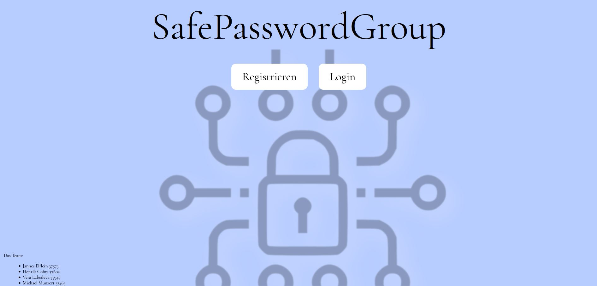
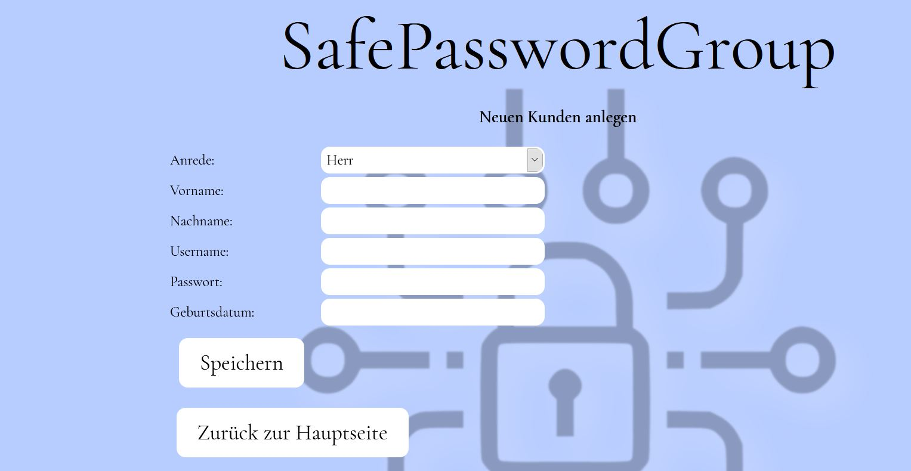
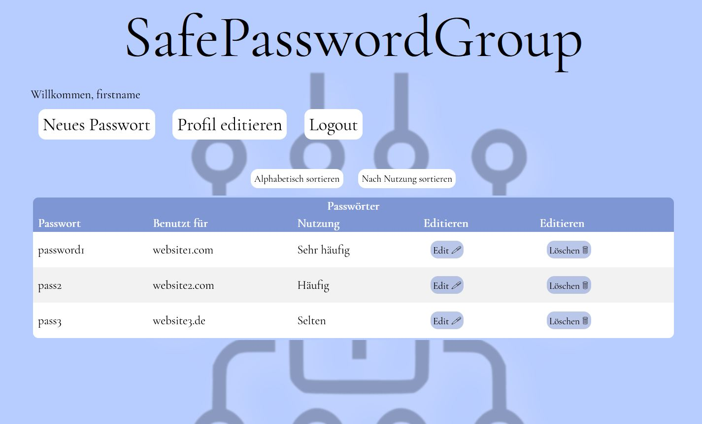
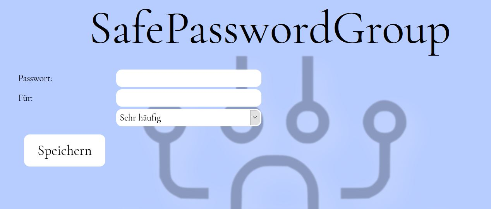
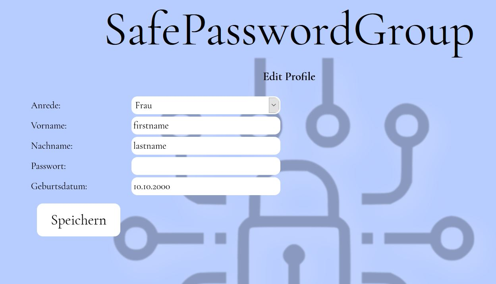
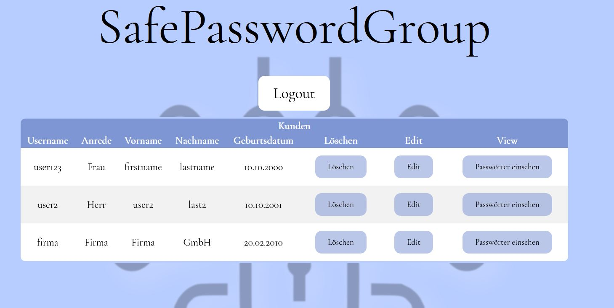

# SafePasswordGroup
Bei diesem dynamischen Web-Projekt handelt es sich um ein Passwortmanagementsystem, in dem Kunden ihre Passwörter speichern und darstellen lassen können. Das Projekt wurde als Maven Projekt mit Java Enterprise 8 und JSF programmiert und kann über den Localhost auf dem Wildfly-Server gestartet werden.

### Installation and Start
1. Lade Wildfly 21.0.0.Final (Jakarta EE Full & Web Distribution) von https://www.wildfly.org/downloads/ herunter
2. Entpacke die .ZIP am gewuenschten Ort.(Z. B. auf dem Desktop)
3. Kopiere die safepasswordgroup.war nach "wildfly-22.0.1.Final\standalone\deployments\"
4. Starte den Wildfly-Server indem die wildfly-preview-22.0.1.Final/bin/standalone.sh auf Linux oder die wildfly-preview-22.0.1.Final\bin\standalone.bat auf Windows ausgefuehrt wird
5. Der Wildfly-Server laeuft jetzt und die safepasswordgroup.war ist deployed
6. Gehe auf http://127.0.0.1:8080/safepasswordgroup/index.xhtml
7. Um den Server zu stoppen druecke Strg+c waerend das Konsolenfenster, welches sich beim start des Servers geoefnet hat im fokus ist.
       Falls die standalone.bat gestartet wurde muss das beenden mit "Y" bestaetigt werden  (Windows only)
       
### Login/ Registrieren
1. Auf http://localhost:8080/safepasswordgroup/index.xhtml gehen
2. Auf Regestrieren klicken, falls noch kein Konto angelegt ist. Mit 4. weitermachen falls Logindaten vorhanden
3. Felder ausfuellen und Speichern anklicken
4. Auf Login klicken
5. Usernamen und Password eingeben und dann auf Login klicken

### Kunden Optionen

1.  Neues Password hinzufuegen
    1. Einloggen
    2. Auf "Neues Passwort" klicken
    3. Felder ausfuellen
    4. Im Dropdownmenue auswaehlen, wie haeufig das Passwort gebraucht wird
    5. Auf Speichern klicken
    
2. Passwoerter sortieren
    1. Einloggen
    2. Auf Alphabetisch "sortieren" oder "Nach Nuzung sortieren" anklicken
3. Passwort Editieren
    1. Einloggen
    2. "Edit" in der Spalte des Passwortes, welches editiert werden soll anklicken
    3. Aenderungen eintragen
    4. "Speichern" anklicken
4. Passwort Loeschen
    1. Einloggen
    2. "Loeschen" in der Spalte des Passwortes, welches geloescht werden soll anklicken
3. Profil editieren
    1. Einloggen
    2. Auf "Profil editieren" klicken
    3. Profil in den Feldern wie gewuenscht editieren
    4. Auf "Speichern" klicken
    
4. Logout
    1. Auf der Hauptseite "Logout" anklicken

### Login als Admin
1. Auf http://localhost:8080/safepasswordgroup/index.xhtml gehen
2. Login anklicken
3. Mit admin als Username und 2424 als Passwort angeben
4. Auf Login klicken

### Admin optionen
1. Kunden Passwoerter einsehen
    1. Login als Admin
    2. "Passwoerter einsehen" in der Spalte des Kunden, welcher eingesehen werden soll anklicken
    3. "Zurueck zur Adminpage" anklicken, um zur Adminpage zurueckzukehren
2. Kunden editieren
    1. Login als Admin
    2. "Edit" in der Spalte des Kunden, welche bearbeitet werden sollen anklicken
    3. aenderungen vornehmen
    4. "Speichern" anklicken
3. Kunden loeschen
    1. Login als Admin
    2. "Loeschen" in der Spalte des Kunden, welcher geloescht werden soll anklicken
4. Logout
    1. "Logout" auf der Adminpage anklicken
